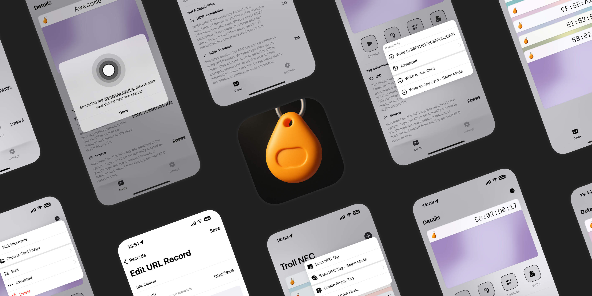

# Troll NFC: Your iPhone NFC Card Tool

  <a href="README.md">English</a> |
  <a href="README_CN.md">简体中文</a>

A versatile tool for reading, writing, managing, and emulating NFC cards on your iPhone.

[Download from GitHub](https://github.com/OwnGoalStudio/TrollNFC/releases)

## 📱 Device Requirements

- **iPhone with NFC**
- **iOS 14.0+**
- **TrollStore Required**

## 🗺️ Road Map

- [x] NFC Driver for iOS 14.0+
- [x] Read and write tags
- [x] Emulate tags with UID & NDEF data
- [ ] Stabilize the NFC driver (we are working on it)
- [ ] Raw data reading and writing
- [ ] Amiibo emulation with importable custom keys
- [ ] Card decryption and encryption

## Core Features

- **Read, Write & Emulate:** Scan, save, and emulate NFC cards directly from your iPhone.
- **Batch Processing:** Read or write multiple cards at once.
- **Advanced Editing:** View and edit NDEF data, including URL records.
- **Import & Backup:** Easily back up and restore your card library.

## New Navigation Features

- **Scroll Preservation:** The `TNFNavigationHelper` injection keeps your card list exactly where you left it, even with hundreds of entries.
- **Horizontal Swiping:** Card detail screens gain left/right swipe (and arrow key) navigation with light preloading and a three-page cache cap for smooth transitions.
- **Last Viewed Highlighting:** Returning to the list subtly highlights the card you just inspected so you can keep track of your place.

---

### 🌍 Join Our Community

Connect with fellow NFC enthusiasts and get support from our team:

- **💬 Discord**: [Join Our Community](https://discord.gg/P2Hn82zS)
- **📧 Support**: [Get Help](mailto:82flex@gmail.com)

---

### 💰 Free Trial & Premium Upgrade

**🆓 Try Before You Buy**

We offer a full-featured free trial that allows you to manage one card with access to all features. This is the perfect way to test full compatibility with your specific cards before purchasing.

**⭐ Premium Upgrade**

- Upgrade to Premium to manage unlimited cards
- **Price**: $9.99 USD / year / per device
- **Full Feature Access**: All advanced tools and capabilities, with unlimited card management

**⚠️ Important Notice**

- Please use the free version first to ensure your cards are compatible
- Due to the nature of providing a full trial, **all purchases are final and non-refundable**
- **Purchase within the app**: Ensure you purchase the subscription from within the app - purchases made through third-party links will not be activated
- **Activation Issues**: If your license fails to activate after purchase, please contact us for manual assistance

---

©️ 2025 OwnGoal Studio, All rights reserved.